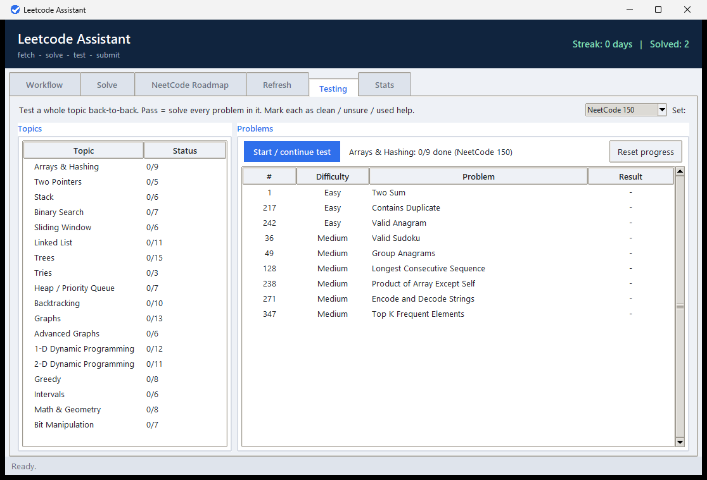

# Leetcode Assistant


A desktop app (and CLI) for a daily LeetCode habit. Fetch a problem, **solve it
in-app** in a built-in code editor, run it against the problem's own example
test cases, and -- when it passes -- commit and push it to your private GitHub
solutions repo. It tracks a local solve streak, follows the NeetCode roadmap,
schedules spaced-repetition refreshes and topic tests, and keeps a presentable
auto-updating README in your solutions repo.



**Download:** grab `LeetCodeAssistant.exe` from the
[latest release](https://github.com/TomShephard/leetcode-assistant/releases/latest)
and double-click -- no Python needed to run the app (Git is needed to push
solutions; Python to run them locally).

```
leetcode fetch      grab a (random or specific) problem and scaffold a file
leetcode test       run the example test cases against your solution
leetcode submit     test, then commit + push a passing solution
leetcode config     set up or view configuration
leetcode stats      show your solve stats and streak
leetcode roadmap    show the NeetCode roadmap and your progress
leetcode list TOPIC list the problems in a roadmap topic
leetcode review     list problems due for spaced-repetition review
leetcode doctor     check your setup (python, git, auth, network)
leetcode clean      remove scaffolded files from a folder
leetcode gui        launch the point-and-click GUI
```

## NeetCode roadmap (structured course)

Work through interview prep as a course instead of random problems. The roadmap
uses NeetCode's curated lists and topic order (Arrays & Hashing -> Two Pointers
/ Stack -> ... -> DP), with prerequisites between topics. Four presets widen
the selection:

- **Blind 75** - the classic 75-problem starter list
- **NeetCode 150** - the default (28 easy / 101 medium / 21 hard)
- **NeetCode 250** - the extended 250-problem list
- **NeetCode (All)** - every roadmap problem (~940)

Your solved count per topic is tracked automatically by cross-referencing your
solve log, and updates as you submit.

```
leetcode roadmap                          # progress per topic at your preset
leetcode roadmap --preset blind75
leetcode list "two pointers"              # problems in a topic, [x] = solved
leetcode list "1-d dp" --preset neetcode250 --unsolved
leetcode fetch --topic "two pointers"     # scaffold a random unsolved one
leetcode fetch --topic trees -p neetcode150 -d medium
```

Presets accept `blind75`, `neetcode150`, `neetcode250`, or `all`.

In the **GUI**, the "NeetCode Roadmap" tab shows the topics in roadmap order
with live done/total counts and a list selector. Click a topic to see its
problems (colour-coded by difficulty, solved ones highlighted, prerequisites
shown), filter by difficulty or unsolved-only, and double-click (or "Fetch
selected") to scaffold it. Switching list re-scopes everything; counts update
as you submit.

### Browse all of LeetCode by topic

Not everything is on the NeetCode roadmap. Pick **"All LeetCode (by topic)"**
from the same list selector to browse LeetCode's full topic taxonomy (arrays,
strings, trees, graphs, DP, and ~20 more) with every problem in each category,
not just the curated ones. From the CLI, the topic commands also accept any
LeetCode topic.

The roadmap dataset ships with the tool (`leetcode_assistant/neetcode_roadmap.json`),
so it works offline and instantly. It was extracted from neetcode.io (which
carries the blind75 / neetcode150 / neetcode250 flags); refresh it any time with
`py tools/refresh_neetcode_data.py`.

## Solve in-app (built-in editor)

The GUI's **Solve** tab puts the problem description next to a code editor
(line numbers, tab-to-spaces, auto-indent, syntax highlighting, find with
`Ctrl+F`, zoom with `Ctrl +/-`) with Run-tests and Submit right there -- so you
can solve a problem end to end without opening a separate IDE. Fetching a
problem drops you straight into it. The Workflow tab's "Open in editor" still
works if you prefer PyCharm/VS Code.

Keyboard shortcuts: `Ctrl+S` save, `Ctrl+Enter` run tests, `Ctrl+Shift+Enter`
submit.

## Refresh -- spaced repetition

Solving a problem once isn't enough to keep it. The **Refresh** tab schedules a
blind retest of every problem you solve, on an expanding ladder so that what you
remember gets pushed further out and what you forget comes back soon:

| Level | Next review |
|-------|-------------|
| Learning  | 7 days  |
| Familiar  | 30 days |
| Confident | 90 days |
| Mastered  | 365 days |

When a problem comes due, pick it in the Refresh tab and **Start blind retest** --
it fetches a fresh, empty copy and opens the Solve tab. After your tests pass,
you rate the attempt:

- **Aced it (no help)** -> move up a level (longer interval)
- **Got it (some hesitation)** -> stay at the same level
- **Needed help** -> back to Learning (retest in a week)

Everything stays in rotation forever (Mastered still retests yearly), and your
solutions repo's README gets a **Review schedule** section showing what's due
and when. Intervals are configurable via `review_intervals` in the config.

`leetcode review` lists what's due from the CLI; `leetcode submit --rating
aced|good|hard` records a rating without the GUI.

## Testing -- topic gauntlets

The **Testing** tab tests a whole topic back-to-back. Pick a topic (e.g. Arrays
& Hashing) and a question set, and **Start / continue test** fetches its problems
one after another. A **pass** means you solved every problem in that topic in the
run. As you submit each one you mark how it went:

- **Solved clean (no help)**
- **Solved but unsure**
- **Used help / a hint**

That single prompt also feeds the Refresh schedule, so you're not asked twice.

Bigger question sets are harder, so a pass records which set you used, and a pass
at a higher set (NeetCode 250 / All) outranks one at a lower set (Blind 75) --
and never gets downgraded. Passes don't expire; the completion time and the full
per-problem log are kept.

Your solutions repo's README gains a **Topic tests** section listing only the
topics you've passed (so unattempted ones don't clutter it), each with its
question set, result, completion time, and a collapsible per-problem log.

## Stats

The **Stats** tab shows a GitHub-style activity heatmap, your current and
longest streaks, per-difficulty counts, and your self-marked optimal ratio.

Stuck on setup? `leetcode doctor` checks Python, git, GitHub auth, network, and
your config, and tells you exactly what's missing.

## Approach and a self-updating solutions README

When you submit, a quick prompt asks how you solved it -- **Optimal**,
**Brute-force / suboptimal**, or **Skip** (Enter accepts Optimal). It's a
self-report rather than an automated guess, so it's always accurate and lets you
deliberately "lock in" a brute-force attempt before redoing it the efficient
way. (You can `leetcode submit --approach optimal|brute|skip` from the CLI.)

Each submission rewrites a presentable `README.md` in your **solutions repo**
from your full solve log: summary badges (solved / streak / per-difficulty /
optimal ratio) and a table of every problem with its date, difficulty, topic,
approach, and solve time, followed by your review schedule and any passed topic
tests.

## Standalone EXE (no Python needed)

Build a double-clickable Windows executable of the GUI:

```
build-exe.cmd
```

This installs PyInstaller (if needed) and produces `dist\LeetCodeAssistant.exe`. You
can move that EXE anywhere (desktop, Start menu) and run it without Python
installed. Note: `git` (and optionally `gh`) still need to be installed for the
submit step, and Node for running JavaScript solutions.

Releases are built automatically: pushing a `vX.Y.Z` tag triggers a GitHub
Actions workflow that builds the EXE and attaches it to the release.

**Windows SmartScreen:** the EXE is not code-signed, so on first run Windows may
show a "Windows protected your PC" prompt. Click **More info -> Run anyway**.
(Code signing requires a paid certificate.)

## Development

```
py -m unittest discover -s tests      # run the test suite (no deps, no network)
py tools/make_icon.py                 # regenerate the app icon
py tools/refresh_neetcode_data.py     # refresh the bundled NeetCode dataset
```

## Keeping your folders tidy

Solution files can pile up. Two ways to manage that:

- **Auto-delete after submit:** tick "Delete local file after a successful
  submit" in the GUI (or set `"delete_after_submit": true` in the config, or run
  `leetcode submit --cleanup`). Once a solution is committed to your repo, the
  local file and its scratch metadata are removed. The streak log is separate,
  so your streak is unaffected.
- **Clean a folder on demand:** the GUI's "Clean folder" button (or
  `leetcode clean [folder]`) removes every file this tool scaffolded in that
  folder. Already-committed solutions remain safe in your repo.

The GUI remembers the last working folder you used (saved as `"workdir"` in the
config), so fetched files keep landing in the same place.

## GUI (no commands)

Prefer buttons over a terminal? Run:

```
py -m leetcode_assistant gui
```

or just double-click `leetcode-gui.cmd` in this folder. The window lets you:

- pick the working folder where solution files are saved,
- set/save your repo URL, language, and difficulty,
- Fetch a problem (random or by number/slug),
- Open the scaffolded file in your editor, edit it, then
- Run tests (pass/fail shown in colour) and Submit (commit + push),
- see your streak update live.

Each section in the Workflow tab is collapsible -- click its header to fold it
away and keep the window tidy. The Output box expands to fill the freed space.

## Run it from PyCharm

This project ships PyCharm run configurations (in `.idea/runConfigurations`).
After opening the project, pick one from the dropdown next to the green Run
button and click Run:

- **LeetCode GUI** - opens the GUI (recommended).
- **LeetCode Fetch (random)** / **Test** / **Submit** - run those commands with
  the working directory set to `practice/`.

First time only: if PyCharm shows "No interpreter", open the config (Run ->
Edit Configurations) and pick your Python 3 interpreter, then Run. The configs
already add the project root to the path, so imports just work.

## Requirements

- Python 3.9+ (no third-party packages; standard library only)
- `git` (used for committing/pushing). The `gh` CLI is used automatically if
  present, otherwise it falls back to raw `git`.
- Node.js is only needed if you want to *run* JavaScript solutions locally.

## Install / run

You don't have to install anything -- the repo ships with launcher shims.

**Windows (PowerShell or cmd):** add this folder to your `PATH`, then:

```
leetcode fetch
```

(`leetcode.cmd` points Python at this folder for you.)

**Unix / git-bash:** make the shim executable and put it on your `PATH`:

```
chmod +x ./leetcode
./leetcode fetch
```

**Or install it as a real command** with pip (creates a `leetcode` entry point):

```
py -m pip install --user -e .
leetcode fetch
```

## First run

The first time you run any command, you'll be asked for:

1. Your private GitHub repo URL (HTTPS or SSH) for storing solutions
2. Preferred language (`python` or `javascript`)
3. Default difficulty filter (`easy` / `medium` / `hard` / `any`)

These are saved to `~/.leetcode-assistant/config.json`. Re-run setup any time with
`leetcode config`, or view current settings with `leetcode config --show`.

## Typical day

```
# 1. Get a problem (random easy, or a specific one)
leetcode fetch -d easy
leetcode fetch two-sum          # by slug
leetcode fetch 1                # by number

# -> writes ./0001-two-sum.py with the description + starter code,
#    and records the example test cases under ./.leetcode/

# 2. Solve it in the scaffolded file, then check your work
leetcode test

# 3. When it passes, ship it
leetcode submit
```

`submit` runs the tests first. If they pass, it commits the file into your repo
using a consistent layout and message:

```
solutions/{difficulty}/{number}-{slug}.{ext}
commit: Solve {number}: {Title} ({Difficulty})
```

**Submit only commits when the tests pass.** If any example test fails, submit
refuses and commits nothing -- there is no override; fix the solution and try
again. If a problem has no auto-extractable example cases (e.g. tree or
linked-list inputs that the tool can't run), submit can't verify it, so it asks
you to confirm before committing.

`test` and `submit` operate on the last problem you fetched in the current
directory by default; pass a filename to target a specific one
(`leetcode test 0001-two-sum.py`).

## How it works

- **Problem data** comes from LeetCode's public endpoints by default
  (`/api/problems/all/` for the index and the GraphQL API for content). This is
  what gives you real descriptions, official starter code, and the example test
  cases needed to actually run `leetcode test`.
- **GitHub dataset (optional):** set `"source": "github"` and a
  `"github_dataset_url"` in the config to pull from a JSON dataset hosted on
  GitHub instead. Note that most such datasets don't ship runnable test cases,
  so `test` will have nothing to run for those.
- **Streak** is computed from `~/.leetcode-assistant/progress.json`, which logs every
  solved problem with its date, number, name, and difficulty. The streak counts
  consecutive days (ending today or yesterday) with at least one solve.

## Notes & limitations

- The local test runner handles the common "call a method with JSON-style
  arguments and compare the return value" shape, with order-insensitive list
  comparison and a small float tolerance. Problems that mutate inputs in place,
  use custom classes (`ListNode`, `TreeNode`), or accept multiple valid answers
  won't verify automatically -- submit treats these as "no test cases" and asks
  you to confirm before committing.
- Premium/locked problems can't be fetched (no public content).
- Config, progress, and the local clone of your repo all live under
  `~/.leetcode-assistant/`.
